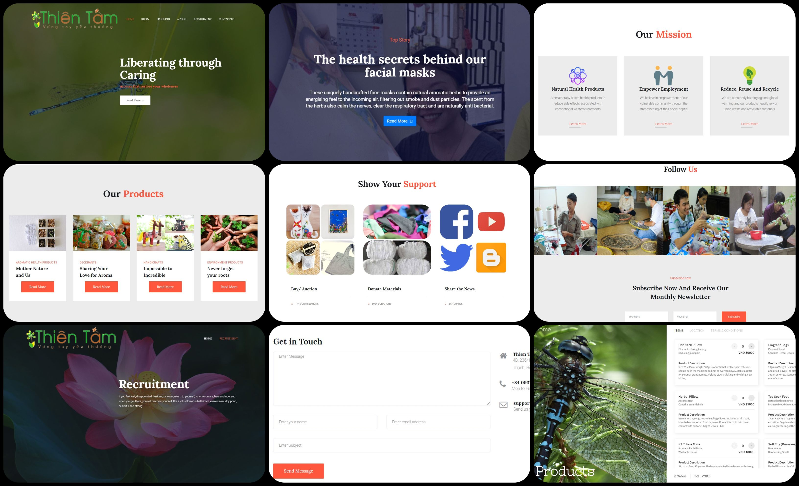

# IDC - Thien Tam Social Enterprise Project

## Executive Summary
Thien Tam is a social enterprise to promote aromatherapy healthcare products over western medicine located in Vietnam. It employs vulnerable workers for production and consists of 8-10 employees.

The purpose of this project is to create a website that highlights the narrative portions of the health benefits of Thuan Thien Tam’s herbal products and emphasise their 3 mottos, namely getting good health naturally, empowering the vulnerable people with employment and reducing damage to the environment. 

A visual html mock-up of the website was created to show the modernised looks and highlight its visual appeals. Website sections are as follows: legacy, top story, selected stories about products, call-to-action and basic information.

The presentation slides can be found at https://docs.google.com/presentation/d/1oN1TCva6bz7YJvtZWvsiRnRLiTnOUNhad-fwchlmt3Y/edit?usp=sharing

## Follow up work needed:
1. The project was purely a UI mock up. It does not include core functionalities and database connections. The upcoming team is required to build the backend based on the UI mockup that has been created. 
2. The website is not mobile friendly. So appropriate front-end work needs to be done to make the website mobile friendly.
Contents of the website need to be updated and/or corrected. A user friendly backend portal needs to be built so that it is easy for anyone to update the content.
3. Language support for Vietnamese needs to be implemented.
4. There is a need for a personnel to create the monthly newsletter to be sent to subscribers and/or maintain the website contents. This process can be automated.

## How to run the code?
1. Clone the repository locally
2. Run **pip install -r requirements.txt** in the terminal
3. Run **python app.py** in the terminal
4. Go to http://0.0.0.0:8000/ to access the web application
